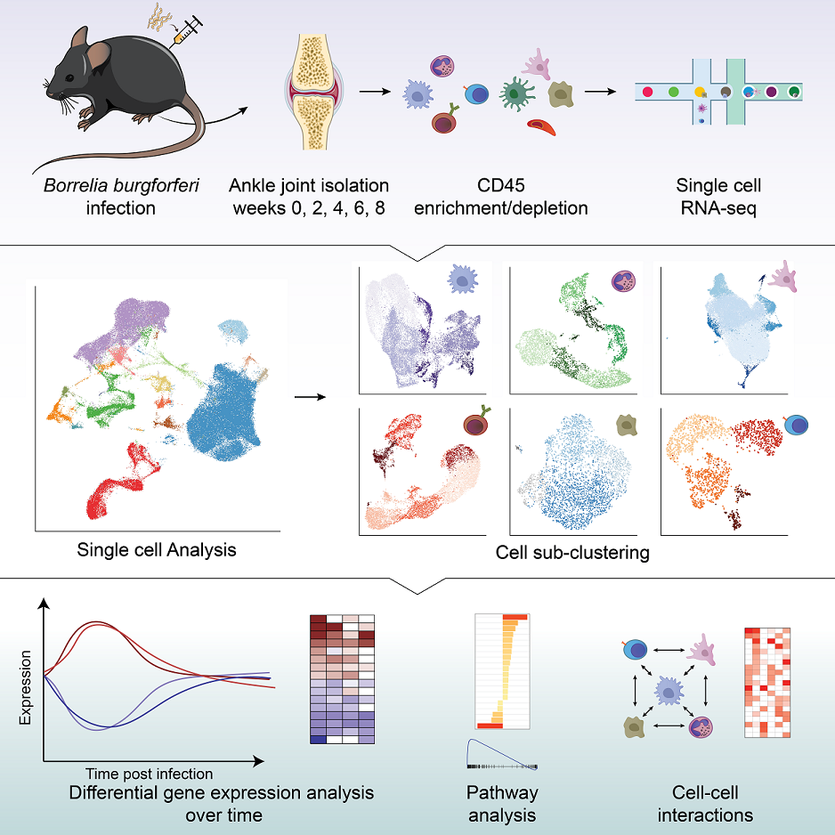

# *Borrelia burgdorferi* single-cell RNA-sequencing code repository

------------------------------------------------------------------------
### Read and cite our research <a href="https://www.cell.com/iscience/fulltext/S2589-0042(23)02294-0" target="_blank">here</a>.

* Explore the [source code](#source-code)

* Download [raw data](#raw-data)

<a href = "https://www.cell.com/iscience/pdf/S2589-0042(23)02294-0.pdf" target = "_blank">

</img>
</a>

#### Source code
Source code for the paper can be found in this GitHub repository. Descriptions for the scripts are as follows:

-   Filtering_clustering.R : Initial filtering and clustering for main UMAP, as well as doublet-exclusion and sub-clustering

-   DEG_GSEA.R : Pseudobulk Differential Gene Expression and Gene Set Enrichment Analysis

-   cell_cell_interaction.R : Uninfected vs week 2 cell-cell interactions 

#### Raw data

Download the raw scRNA-seq data from NCBI GEO <a href = "https://www.ncbi.nlm.nih.gov/geo/query/acc.cgi?acc=GSE233850" target="_blank">GSE233850</a>
